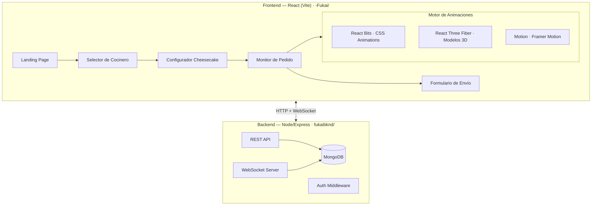
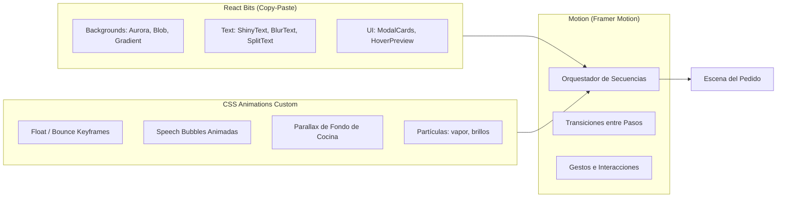
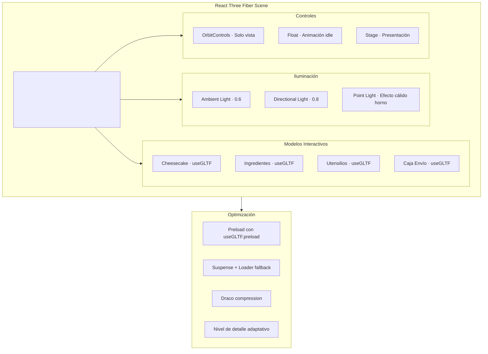
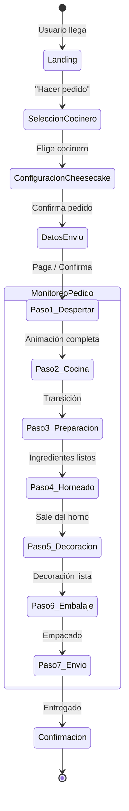

# 深い Fukai — Plan de Implementación

Plataforma inmersiva de repostería artesanal con monitoreo en tiempo real de pedidos. El usuario selecciona un cocinero (Capibara, Hello Kitty o Aguacate), personaliza su cheesecake, y vive una experiencia animada e interactiva mientras su pedido se prepara, empaca y envía.

---

## Arquitectura General



---

## User Review Required

> [!IMPORTANT]
> **Modelos 3D:** El plan asume que se usarán modelos `.glb` descargados de fuentes gratuitas (Poly Pizza, Sketchfab) para el cheesecake e ingredientes. Si prefieres modelos custom hechos en Blender, la fase de assets se extiende. ¿Prefieres usar modelos gratuitos pre-hechos o crear los propios?

> [!IMPORTANT]
> **Base de datos:** Se usará MongoDB Atlas (cloud) para simplificar el setup. ¿Tienes un cluster ya creado o prefieres una instancia local con Docker?

> [!WARNING]
> **Autenticación:** El plan incluye JWT básico para los 4 roles (cliente, cocinero, repartidor, admin). ¿Quieres autenticación por email/password, OAuth con Google, o ambos?

## Open Questions

1. **Decoraciones:** ¿Cuáles son los ingredientes de decoración disponibles para el cheesecake? (ej: fresas, arándanos, chocolate, caramelo, mermelada, etc.)
2. **Repartidor:** ¿El repartidor es un rol interno del sistema o se conectará con una API de delivery externa?
3. **Pagos:** ¿Se integrará pasarela de pagos (Stripe, MercadoPago) en esta primera versión o se gestionará externamente?
4. **Notificaciones:** ¿Se desean notificaciones push/email además del monitoreo en tiempo real en la web?

---

## Proposed Changes

### Fase 0 — Setup del Proyecto

#### [MODIFY] [-Fukai/](file:///c:/Users/USUARIO/Desktop/Fukai/-Fukai) (Inicialización Frontend)

Inicializar proyecto React con Vite dentro de la carpeta existente `-Fukai/`:

```bash
npx -y create-vite@latest ./ --template react
npm install
```

**Dependencias principales:**
| Paquete | Propósito |
|---|---|
| `@react-three/fiber` | Renderizado 3D en React |
| `@react-three/drei` | Helpers 3D (useGLTF, OrbitControls, Float, etc.) |
| `motion` (Framer Motion) | Orquestación de animaciones y transiciones |
| `react-router-dom` | Enrutamiento SPA |
| `socket.io-client` | Comunicación WebSocket en tiempo real |
| `axios` | Peticiones HTTP al backend |
| `zustand` | Estado global ligero |

> [!NOTE]
> **React Bits** se integra por copy-paste (no es un paquete npm). Los componentes seleccionados se copiarán directamente en `src/components/reactbits/`.

#### [MODIFY] [fukaibknd/](file:///c:/Users/USUARIO/Desktop/Fukai/fukaibknd) (Inicialización Backend)

```bash
npm init -y
npm install express mongoose socket.io cors dotenv jsonwebtoken bcryptjs
npm install -D nodemon
```

---

### Fase 1 — Sistema de Diseño y Assets

#### [NEW] `src/styles/design-system.css`

Paleta de colores inspirada en estética japonesa minimalista + kawaii:

```css
:root {
  /* Paleta principal */
  --fukai-cream:     hsl(36, 60%, 95%);     /* Fondo suave */
  --fukai-blush:     hsl(350, 65%, 78%);    /* Acentos cálidos */
  --fukai-matcha:    hsl(140, 35%, 55%);    /* Aguacate / natural */
  --fukai-caramel:   hsl(30, 70%, 50%);     /* Capibara / dorado */
  --fukai-sakura:    hsl(340, 80%, 85%);    /* Hello Kitty / rosa */
  --fukai-deep:      hsl(270, 20%, 15%);    /* Texto principal (深い) */
  --fukai-mochi:     hsl(280, 15%, 92%);    /* Fondos secundarios */
  
  /* Tipografía */
  --font-display: 'Outfit', sans-serif;
  --font-body: 'Inter', sans-serif;
  --font-japanese: 'Noto Sans JP', sans-serif;
  
  /* Espaciado & Animación */
  --ease-spring: cubic-bezier(0.34, 1.56, 0.64, 1);
  --ease-smooth: cubic-bezier(0.25, 0.1, 0.25, 1);
  --duration-fast: 200ms;
  --duration-normal: 400ms;
  --duration-slow: 800ms;
}
```

#### [NEW] `src/assets/models/` — Modelos 3D (.glb)

Modelos necesarios a obtener/crear:
- `cheesecake_base.glb` — Cheesecake base sin decoración
- `plate.glb` — Plato/base de presentación
- `strawberry.glb`, `blueberry.glb`, `chocolate_drip.glb` — Decoraciones
- `mixing_bowl.glb`, `whisk.glb`, `oven.glb` — Utensilios de cocina
- `delivery_box.glb` — Caja de envío

#### [NEW] `src/assets/backgrounds/` — Fondos de cocina animados

Se crearán fondos ilustrados de cocina kawaii como imágenes estáticas con capas separadas para parallax CSS.

---

### Fase 2 — Motor de Animaciones CSS (React Bits) 🎬

> [!IMPORTANT]
> **Este es el núcleo visual de la plataforma.** La correcta implementación del motor de animaciones determina la experiencia inmersiva del usuario.

#### Arquitectura del Motor de Animaciones



#### [NEW] `src/components/reactbits/` — Componentes React Bits

Componentes específicos a copiar desde reactbits.dev (variante JS+CSS):

| Componente | Uso en Fukai | Paso de la secuencia |
|---|---|---|
| **Aurora / Soft Aurora** | Fondo ambiente de la cocina | Todos los pasos |
| **Blob** | Efecto orgánico detrás del cocinero | Selección de cocinero |
| **Gradient** | Transiciones suaves entre pasos | Transiciones |
| **Shiny Text** | Título "深い Fukai" en landing | Landing |
| **Blur Text** | Revelación progresiva de mensajes | Nubes de texto |
| **Splash Cursor** | Cursor interactivo durante espera | Monitor de pedido |
| **Beams** | Líneas de energía durante preparación | Paso: Preparación |
| **Pixel Trail** | Rastro visual de progreso | Barra de progreso |

#### [NEW] `src/animations/` — Motor de Animaciones Custom

##### `src/animations/keyframes.css`

```css
/* Animaciones fundamentales para las secuencias de pedido */

@keyframes cookerWakeUp {
  0%   { transform: scale(0.8) rotate(-5deg); opacity: 0; filter: blur(4px); }
  40%  { transform: scale(1.1) rotate(3deg); opacity: 1; filter: blur(0); }
  60%  { transform: scale(0.95) rotate(-1deg); }
  100% { transform: scale(1) rotate(0deg); opacity: 1; }
}

@keyframes floatGentle {
  0%, 100% { transform: translateY(0) rotate(0deg); }
  25%      { transform: translateY(-8px) rotate(1deg); }
  75%      { transform: translateY(4px) rotate(-1deg); }
}

@keyframes speechBubbleIn {
  0%   { transform: scale(0) translateY(20px); opacity: 0; }
  50%  { transform: scale(1.1) translateY(-5px); }
  100% { transform: scale(1) translateY(0); opacity: 1; }
}

@keyframes steamRise {
  0%   { transform: translateY(0) scale(1); opacity: 0.6; }
  50%  { transform: translateY(-30px) scale(1.5); opacity: 0.3; }
  100% { transform: translateY(-60px) scale(2); opacity: 0; }
}

@keyframes ingredientDrop {
  0%   { transform: translateY(-100px) rotate(45deg); opacity: 0; }
  60%  { transform: translateY(10px) rotate(-10deg); opacity: 1; }
  80%  { transform: translateY(-5px) rotate(5deg); }
  100% { transform: translateY(0) rotate(0deg); opacity: 1; }
}

@keyframes boxClose {
  0%   { transform: rotateX(0deg); transform-origin: top; }
  100% { transform: rotateX(-180deg); transform-origin: top; }
}

@keyframes deliverySlide {
  0%   { transform: translateX(0); }
  100% { transform: translateX(calc(100vw + 200px)); }
}

@keyframes pulseGlow {
  0%, 100% { box-shadow: 0 0 5px var(--fukai-sakura); }
  50%      { box-shadow: 0 0 25px var(--fukai-sakura), 0 0 50px var(--fukai-blush); }
}
```

##### `src/animations/SequenceOrchestrator.jsx`

Controlador central que maneja la secuencia completa de animaciones para cada paso del pedido. Usa **Framer Motion** `AnimatePresence` + `variants` para orquestar las transiciones y **React Bits** para los efectos visuales de fondo.

```
Responsabilidades:
1. Recibir el estado actual del pedido vía WebSocket
2. Determinar qué paso de la secuencia mostrar
3. Orquestar la entrada/salida de elementos con stagger
4. Sincronizar animaciones CSS con modelos 3D
5. Manejar las nubes de texto y mensajes del cocinero
```

##### `src/animations/SpeechBubble.jsx`

Componente de nube de texto animada con variantes para cada cocinero:
- **Capibara:** Burbuja redondeada, color caramelo
- **Hello Kitty:** Burbuja con corazón, color sakura
- **Aguacate:** Burbuja orgánica, color matcha

##### `src/animations/ParticleEffects.jsx`

Efectos de partículas CSS puro (sin canvas) para:
- Vapor saliendo del horno
- Brillos al completar un paso
- Confetti al entregar el pedido
- Corazones flotantes del cocinero

##### Reglas Críticas del Motor de Animaciones CSS

> [!CAUTION]
> **Rendimiento:** Todas las animaciones CSS DEBEN usar exclusivamente `transform` y `opacity` para evitar reflows. NUNCA animar `width`, `height`, `top`, `left`, `margin`, o `padding`.

> [!IMPORTANT]
> **Composición de capas:**
> ```
> z-index: 0   → Fondo de cocina (React Bits Aurora/Gradient)
> z-index: 10  → Parallax de utensilios y ambiente
> z-index: 20  → Modelos 3D (Canvas de React Three Fiber)
> z-index: 30  → Cocinero seleccionado (PNG animado con CSS)
> z-index: 40  → Nubes de texto / Speech Bubbles
> z-index: 50  → UI de progreso y controles
> z-index: 100 → Modales y overlays
> ```

> [!IMPORTANT]
> **`will-change` y GPU:**
> - Aplicar `will-change: transform, opacity` SOLO a elementos que están activamente animándose
> - Remover `will-change` cuando la animación termina usando `onAnimationEnd`
> - Usar `transform: translateZ(0)` para forzar composición GPU en capas críticas
> - Limitar a máximo **8-10 capas compuestas** simultáneas para evitar memory pressure

> [!TIP]
> **`prefers-reduced-motion`:** Siempre respetar la preferencia del usuario:
> ```css
> @media (prefers-reduced-motion: reduce) {
>   *, *::before, *::after {
>     animation-duration: 0.01ms !important;
>     transition-duration: 0.01ms !important;
>   }
> }
> ```

---

### Fase 3 — Manipulación de Modelos 3D (React Three Fiber) 🧊

> [!IMPORTANT]
> **Este es el segundo pilar visual.** Los modelos 3D deben integrarse fluidamente con las animaciones CSS sin competir por recursos GPU.

#### Arquitectura 3D



#### [NEW] `src/components/3d/CheesecakeModel.jsx`

Componente principal del cheesecake 3D:

```
Funcionalidades:
- Carga modelo base .glb con useGLTF
- Nodos separados por partes: base, filling, topping
- Decoraciones se agregan/remueven dinámicamente
- Animación de rotación suave (autoRotate)
- Animación de "construcción" paso a paso durante preparación
- Eventos: onClick por ingrediente, onPointerOver para highlight
```

#### [NEW] `src/components/3d/KitchenScene.jsx`

Escena 3D de la cocina durante la preparación:

```
Funcionalidades:
- Utensilios animados (batir, mezclar, hornear)
- Transición de ingredientes hacia el cheesecake
- Efectos de partículas 3D (harina, vapor)
- Iluminación dinámica que cambia con cada paso
```

#### [NEW] `src/components/3d/DeliveryScene.jsx`

Escena 3D del empaque y envío:

```
Funcionalidades:
- Cheesecake entra en la caja (animación)
- Caja se cierra (rotación de tapa)
- Caja se desliza fuera de escena
- Moño/lazo se anima sobre la caja
```

#### [NEW] `src/components/3d/ModelPreloader.jsx`

Sistema de precarga inteligente de modelos:

```jsx
// Precargar todos los modelos al inicio para evitar lag
useGLTF.preload('/models/cheesecake_base.glb')
useGLTF.preload('/models/plate.glb')
useGLTF.preload('/models/strawberry.glb')
// ... etc
```

#### Reglas Críticas para Modelos 3D

> [!CAUTION]
> **Coexistencia CSS + Canvas 3D:**
> - El `<Canvas>` de R3F crea su propio contexto WebGL. NUNCA superponer múltiples Canvas.
> - Usar UN SOLO `<Canvas>` con `pointer-events: none` en el container y `pointer-events: auto` solo en elementos interactivos.
> - El Canvas debe tener `position: absolute` y estar dentro del sistema de z-index definido arriba.

> [!IMPORTANT]
> **Optimización de modelos .glb:**
> - Todos los modelos deben pasar por **Draco compression** (`npx gltf-pipeline -i model.glb -o model_compressed.glb -d`)
> - Texturas máximo **1024x1024** para mobile, **2048x2048** para desktop
> - Polígonos por modelo: máximo **10K tris** para ingredientes, **30K tris** para cheesecake
> - Usar `<Suspense>` con fallback visual (silueta/placeholder) mientras carga

> [!TIP]
> **Sincronización CSS ↔ 3D:**
> ```
> El estado del pedido (Zustand store) es la FUENTE ÚNICA DE VERDAD.
> 
> WebSocket → Zustand Store → { Animaciones CSS, Escena 3D }
>                                    ↑ ambos leen del mismo estado
> 
> NUNCA sincronizar directamente entre CSS y 3D.
> Siempre pasar por el store centralizado.
> ```

> [!WARNING]
> **Performance Budget:**
> - Target: **60 FPS** en dispositivos mid-range
> - Usar `useFrame` con throttle para lógica no-visual
> - Implementar `<AdaptiveDpr>` y `<AdaptiveEvents>` de drei
> - Desactivar `OrbitControls` durante las secuencias animadas
> - Usar `frameloop="demand"` cuando no hay animación activa

---

### Fase 4 — Secuencia de Pedido (La Experiencia Inmersiva) 🎭

Esta es la **experiencia central** que vive el cliente. Cada paso tiene animaciones CSS y modelos 3D específicos coordinados por el `SequenceOrchestrator`.

#### Flujo Completo de la Secuencia



#### Detalle de Cada Paso con Animaciones

---

##### 🟡 Paso 1: "El Despertar del Cocinero"

| Capa | Animación | Técnica |
|---|---|---|
| **Fondo** | Pantalla oscura → Aurora suave se enciende | React Bits `Aurora` con opacity transition |
| **Cocinero** | PNG del cocinero aparece con `cookerWakeUp` keyframe | CSS `@keyframes` + `animation-fill-mode: forwards` |
| **Texto** | "¡Buenos días! Voy a preparar tu cheesecake 🍰" | `SpeechBubble` con `speechBubbleIn` animation |
| **Sonido** | (Opcional) Sonido suave de campana | Web Audio API |
| **3D** | Ninguno aún — foco en el cocinero 2D | — |

**CSS Clave:**
```css
.cooker-entrance {
  animation: cookerWakeUp 1.2s var(--ease-spring) forwards;
  will-change: transform, opacity, filter;
}
```

---

##### 🟠 Paso 2: "La Cocina se Revela"

| Capa | Animación | Técnica |
|---|---|---|
| **Fondo** | Fondo de cocina ilustrado entra con parallax multicapa | CSS `transform: translateX()` con `perspective` |
| **Ambiente** | Utensilios flotan suavemente en el fondo | `floatGentle` keyframe con `animation-delay` stagger |
| **Cocinero** | Se mueve a su posición de trabajo | Framer Motion `animate={{ x, y }}` |
| **Texto** | "¡Mira mi cocina! Aquí ocurre la magia ✨" | SpeechBubble con delay |
| **3D** | Plato vacío aparece, rota suavemente | R3F `<Float>` + `autoRotate` en useFrame |
| **React Bits** | `Beams` emanan del horno | Componente copiado, color cálido |

**Parallax CSS:**
```css
.kitchen-layer-back  { transform: translateZ(-300px) scale(1.3); }
.kitchen-layer-mid   { transform: translateZ(-150px) scale(1.15); }
.kitchen-layer-front { transform: translateZ(0); }

.kitchen-container {
  perspective: 600px;
  transform-style: preserve-3d;
}
```

---

##### 🔴 Paso 3: "La Preparación"

| Capa | Animación | Técnica |
|---|---|---|
| **Fondo** | Aurora cambia a tonos cálidos | React Bits Aurora con props dinámicos |
| **Cocinero** | Se mueve/balancea con CSS bounce | `animation: floatGentle 3s infinite` |
| **Texto** | "Mezclando los ingredientes... 🥚🧈" | SpeechBubble secuencial |
| **3D** | Bowl + batidor animados, ingredientes caen al bowl | R3F: `ingredientDrop` via useSpring, useFrame para batir |
| **Partículas** | Harina volando, burbujas de mezcla | CSS particles con `steamRise` variant |
| **React Bits** | `Beams` intensificados | Velocidad aumentada |

**Sincronización 3D ↔ CSS:**
```
Estado: "mixing"
  → CSS: Cocinero balancea, partículas de harina
  → 3D: Bowl rota, batidor sube/baja, ingredientes caen
  → Timing: useFrame cuenta frames, despacha eventos al store
```

---

##### 🟣 Paso 4: "El Horneado"

| Capa | Animación | Técnica |
|---|---|---|
| **Fondo** | Tonos se calientan, efecto de calor (haze) | CSS `backdrop-filter: blur()` pulsante |
| **Cocinero** | Mira hacia el horno, espera con animación idle | CSS `floatGentle` reducido |
| **Texto** | "En el horno... la paciencia es un ingrediente 🔥" | SpeechBubble |
| **3D** | Cheesecake base dentro del horno, puerta abierta → cierra | R3F: rotación de puerta del horno, point light cálida |
| **Partículas** | Vapor sale del horno | CSS `steamRise` con múltiples instancias |
| **Progreso** | Timer visual / barra de progreso | React Bits `Pixel Trail` como barra |

---

##### 🟢 Paso 5: "La Decoración"

| Capa | Animación | Técnica |
|---|---|---|
| **Fondo** | Colores frescos, celebración suave | React Bits Gradient, colores vivos |
| **Cocinero** | Animación de emoción (bouncing) | CSS scale + translate keyframe |
| **Texto** | "¡Ahora lo más divertido! A decorar 🍓🫐" | SpeechBubble entusiasta |
| **3D** | Ingredientes de decoración caen sobre el cheesecake | R3F: cada decoración seleccionada hace `ingredientDrop` 3D |
| **Interacción** | El usuario VE las decoraciones que eligió siendo colocadas | Secuencia programática basada en el pedido |
| **React Bits** | Splash Cursor activo para sentir el toque | `SplashCursor` componente |

---

##### 📦 Paso 6: "El Embalaje"

| Capa | Animación | Técnica |
|---|---|---|
| **Fondo** | Suave, preparando para despedida | React Bits Aurora suave |
| **Cocinero** | Envuelve con cariño (animación de abrazo al cheesecake) | CSS custom keyframe |
| **Texto** | "Empacando con mucho amor 💝" | SpeechBubble |
| **3D** | Cheesecake decorado → entra en caja → caja se cierra → moño se ata | R3F: secuencia de `boxClose` + ribbon animation |
| **Transición** | Caja brilla con `pulseGlow` | CSS `pulseGlow` keyframe |

**Secuencia 3D de embalaje:**
```
Frame 0-30:    Cheesecake flota hacia la caja abierta
Frame 30-60:   Cheesecake desciende dentro de la caja
Frame 60-90:   Tapa de la caja rota (cierre) → boxClose
Frame 90-120:  Moño/cinta aparece y se ata
Frame 120-150: Caja brilla → pulseGlow CSS overlay
```

---

##### 🚀 Paso 7: "El Envío"

| Capa | Animación | Técnica |
|---|---|---|
| **Fondo** | Escena exterior, cielo con nubes | React Bits Gradient + nubes CSS |
| **Cocinero** | Se despide con la mano (wave animation) | CSS rotate en brazo |
| **Texto** | "¡Tu cheesecake va en camino! 🚗💨" | SpeechBubble final |
| **3D** | Caja se desliza fuera de escena con trail | R3F: translate + fade |
| **Confetti** | Explosión de confetti celebratorio | CSS particles múltiples |
| **React Bits** | `Beams` como estelas de velocidad | Beams horizontales |
| **Formulario** | Datos de envío (si no se ingresaron antes) | Modal animado con Motion |

---

### Fase 5 — Backend (Node + Express + MongoDB)

#### [NEW] `fukaibknd/src/models/`

| Modelo | Campos Clave |
|---|---|
| `User.js` | nombre, email, password, rol (cliente/cocinero/repartidor/admin), avatar |
| `Order.js` | usuario, cocinero, cheesecake (tipo, decoraciones), estado, timestamps por paso |
| `Cheesecake.js` | tipo (horneado/refrigerado), decoraciones[], precio, descripción |

#### [NEW] `fukaibknd/src/routes/`

| Ruta | Método | Descripción |
|---|---|---|
| `/api/auth/register` | POST | Registro de usuario |
| `/api/auth/login` | POST | Login, retorna JWT |
| `/api/orders` | POST | Crear pedido |
| `/api/orders/:id` | GET | Obtener pedido con estado |
| `/api/orders/:id/status` | PATCH | Actualizar paso (cocinero/admin) |
| `/api/cheesecakes` | GET | Catálogo de cheesecakes |
| `/api/cookers` | GET | Lista de cocineros disponibles |

#### [NEW] `fukaibknd/src/websocket/`

WebSocket server con Socket.IO para:
- `order:statusUpdate` — Emitir cambio de paso en tiempo real
- `order:subscribe` — Cliente se suscribe a su pedido
- Rooms por `orderId` para aislar notificaciones

---

### Fase 6 — Páginas y Componentes Frontend

#### [NEW] `src/pages/LandingPage.jsx`

- Hero con logo 深い Fukai y los 3 cocineros (PNGs animados)
- Descripción filosófica con Blur Text de React Bits
- Background Aurora de React Bits
- CTA "Hacer mi pedido" con hover animation

#### [NEW] `src/pages/CookerSelectPage.jsx`

- 3 tarjetas interactivas: Capibara, Hello Kitty, Aguacate
- Cada tarjeta usa la imagen PNG + nombre
- Hover: escala, glow con color del cocinero, Blob de React Bits detrás
- Selección: animación de confirmación + transición

#### [NEW] `src/pages/CheesecakeBuilderPage.jsx`

- Modelo 3D interactivo del cheesecake
- Selector de tipo: horneado vs refrigerado
- Selector de decoraciones (toggle ingredientes sobre el modelo 3D)
- Resumen del pedido + precio
- Botón confirmar

#### [NEW] `src/pages/OrderMonitorPage.jsx`

- **Esta es la página principal de la experiencia**
- Contiene el `SequenceOrchestrator`
- Barra de progreso lateral/superior con los 7 pasos
- Canvas 3D integrado con las animaciones CSS
- Conexión WebSocket para updates en tiempo real

#### [NEW] `src/pages/ShippingFormPage.jsx`

- Formulario de datos de envío
- Modal animado con Motion
- Puede aparecer al inicio (antes del monitoreo) o al final (paso 7)

#### [NEW] `src/pages/AdminDashboard.jsx`

- Panel para actualizar estado de pedidos manualmente
- Vista de todos los pedidos activos
- Botones para avanzar cada pedido al siguiente paso

---

### Estructura de Archivos Final

```
-Fukai/
├── public/
│   └── models/          ← Modelos .glb comprimidos con Draco
├── src/
│   ├── animations/
│   │   ├── keyframes.css
│   │   ├── SequenceOrchestrator.jsx
│   │   ├── SpeechBubble.jsx
│   │   ├── ParticleEffects.jsx
│   │   └── useAnimationSync.js       ← Hook de sincronización CSS↔3D
│   ├── assets/
│   │   ├── avo.png, capi.png, kitty.png, logo.png
│   │   └── backgrounds/
│   ├── components/
│   │   ├── reactbits/                ← Componentes copy-paste de React Bits
│   │   │   ├── Aurora.jsx
│   │   │   ├── Blob.jsx
│   │   │   ├── ShinyText.jsx
│   │   │   ├── BlurText.jsx
│   │   │   ├── SplashCursor.jsx
│   │   │   ├── Beams.jsx
│   │   │   └── PixelTrail.jsx
│   │   ├── 3d/
│   │   │   ├── CheesecakeModel.jsx
│   │   │   ├── KitchenScene.jsx
│   │   │   ├── DeliveryScene.jsx
│   │   │   └── ModelPreloader.jsx
│   │   ├── ui/
│   │   │   ├── Navbar.jsx
│   │   │   ├── ProgressBar.jsx
│   │   │   ├── CookerCard.jsx
│   │   │   └── IngredientSelector.jsx
│   │   └── layout/
│   │       └── AppLayout.jsx
│   ├── hooks/
│   │   ├── useWebSocket.js
│   │   ├── useOrderStatus.js
│   │   └── useAnimationSync.js
│   ├── pages/
│   │   ├── LandingPage.jsx
│   │   ├── CookerSelectPage.jsx
│   │   ├── CheesecakeBuilderPage.jsx
│   │   ├── OrderMonitorPage.jsx
│   │   ├── ShippingFormPage.jsx
│   │   └── AdminDashboard.jsx
│   ├── store/
│   │   ├── useAuthStore.js
│   │   └── useOrderStore.js
│   ├── styles/
│   │   ├── design-system.css
│   │   ├── landing.css
│   │   ├── cooker-select.css
│   │   ├── order-monitor.css
│   │   └── animations.css
│   ├── services/
│   │   ├── api.js                    ← Axios instance
│   │   └── socket.js                 ← Socket.IO client
│   ├── App.jsx
│   ├── main.jsx
│   └── index.css
├── package.json
└── vite.config.js

fukaibknd/
├── src/
│   ├── models/
│   │   ├── User.js
│   │   ├── Order.js
│   │   └── Cheesecake.js
│   ├── routes/
│   │   ├── auth.js
│   │   ├── orders.js
│   │   └── cheesecakes.js
│   ├── middleware/
│   │   └── auth.js
│   ├── websocket/
│   │   └── orderSocket.js
│   └── config/
│       └── db.js
├── server.js
├── .env
└── package.json
```

---

## Verification Plan

### Automated Tests

```bash
# Frontend — Build sin errores
cd -Fukai && npm run build

# Backend — Server inicia correctamente
cd fukaibknd && npm start

# Lint
npm run lint
```

### Manual Verification

1. **Animaciones CSS:** Verificar cada paso de la secuencia en Chrome DevTools → Performance tab (target: 60 FPS constante, sin layout shifts)
2. **Modelos 3D:** Verificar carga de todos los `.glb`, interactividad en el configurador, y secuencias del monitor
3. **WebSocket:** Abrir 2 tabs — admin avanza paso → cliente ve la animación correspondiente en tiempo real
4. **Responsive:** Probar en viewport 375px (mobile), 768px (tablet), 1440px (desktop)
5. **`prefers-reduced-motion`:** Activar en sistema operativo y verificar que las animaciones se desactivan
6. **Performance:** Lighthouse audit con target > 85 en Performance
